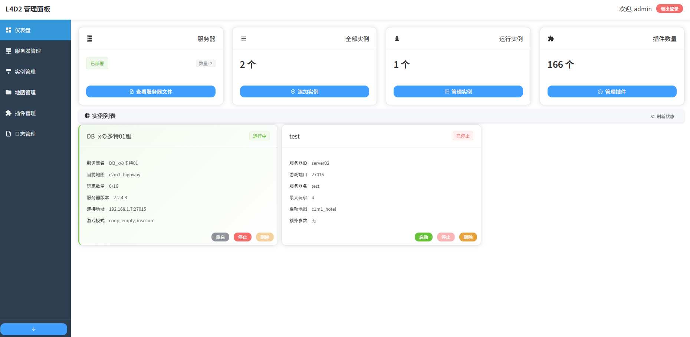
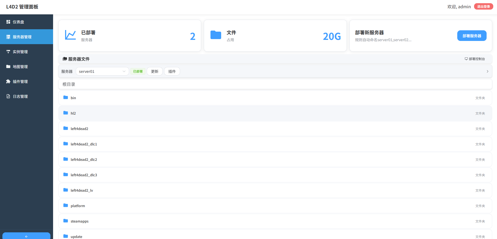
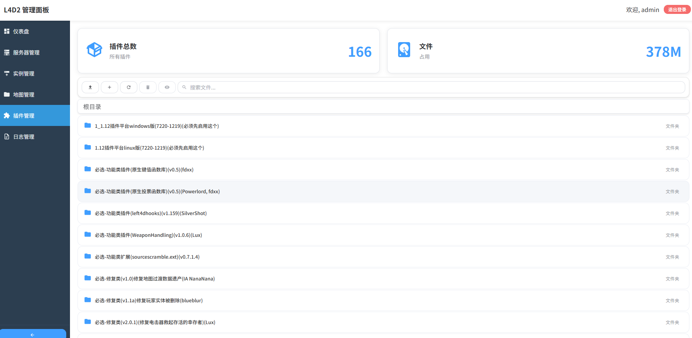
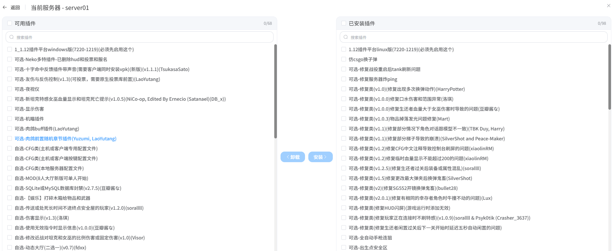
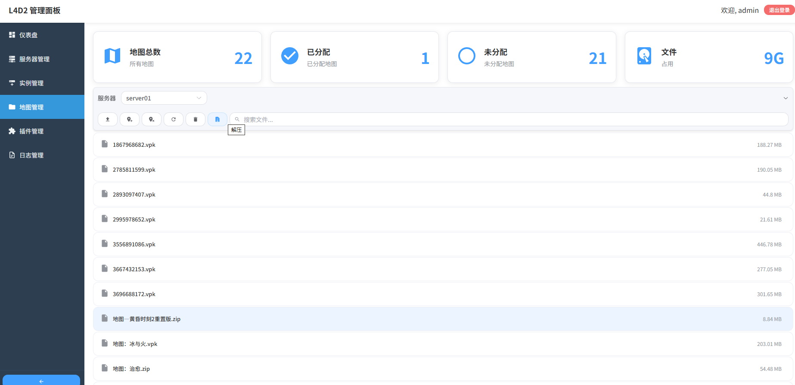

# L4D2 服务器管理面板 🎮

一个 Left 4 Dead 2 专用服务器管理面板,提供可视化的服务器实例管理、插件管理和配置管理功能。

### 本人代码写的不好,大部分都是问的AI- T T见谅

## 📋 项目简介

本项目旨在简化 L4D2 服务器的部署、配置和插件管理流程,为服主提供直观的管理界面,降低运维门槛。支持多实例管理、丰富的插件库和自动化配置。

## ✨ 功能特性

### 🎯 核心功能

- **服务器实例管理**：创建、启动、停止、重启多个 L4D2 服务器实例
- **插件管理**：提供预分类的插件库(必选/可选/修复类),支持一键安装和管理
- **地图管理**：上传、分配和管理游戏地图
- **文件管理**：浏览、编辑、上传、下载服务器文件
- **实时日志**：查看服务器运行日志和系统日志
- **用户认证**：安全的登录认证机制

### 🛠️ 技术特性

- **现代化前端**：Vue 3 + Vite + Element Plus + Pinia
- **高性能后端**：Node.js + Express
- **进程管理**：使用 node-pty 管理游戏服务器进程
- **WebSocket 通信**：下载实时更新服务器状态和日志
- **Docker 部署**：支持容器化一键部署
- **响应式设计**：适配不同屏幕尺寸

## 📸 界面预览

### 主页仪表盘



### 服务器管理



### 插件管理



### 具体插件分配



### 地图管理



## 🚀 快速开始

### 环境要求

- Node.js 24+ (由 Dockerfile 指定)
- Docker & Docker Compose (推荐)
- 或本地开发环境:
  - Node.js 24+
  - npm/yarn/pnpm
  - Linux 系统(推荐,用于运行 L4D2 服务器)

## Docker 部署(推荐)

#### 1. 克隆项目

```bash
git clone https://github.com/DoLo1234/DBx_L4D2_Panel.git
cd DBx_L4D2_Panel
```

#### 2. 构建并启动

```bash
docker-compose up -d
```

## 普通启动方式

**Windows 用户（推荐）：**

- 启动时最好是权限高的用户-因为地图分配要使用到软连接
- 直接以管理员身份运行 `start.bat` 文件，或命令行执行：

```bash
start.bat
```

脚本会自动请求管理员权限，然后在新窗口中启动后端服务。

**Linux 用户（推荐）：**

- 启动时最好是权限高的用户-因为地图分配要使用到软连接
- 使用交互式菜单脚本 `start.sh` 进行管理：

- 先确保安装node.js 24+版本
- 官网链接 https://nodejs.org/zh-cn/download

**安装依赖：**

- node-pty 需要安装编译工具
- build-essential python3

```base
sudo apt install -y make gcc g++ python3
```

- 注意!：如果启动报错请重新编译node-pty

```bash
npm rebuild node-pty
```

**后续执行脚本：**

```bash
# 首次设置执行权限
chmod +x start.sh

# 运行管理菜单
./start.sh
```

交互式菜单提供以下功能：

- **1. Start Backend** - 启动后端服务
- **2. Stop Backend** - 停止后端服务
- **3. View Status** - 查看运行状态
- **4. View Logs** - 查看后端日志
- **5. Attach to Session** - 连接到后端会话（如可用）
- **0. Exit** - 退出菜单

**💡 提示：**

- 脚本会自动请求 root 权限
- 所有管理功能都集成在一个菜单中

**手动启动（不推荐）：**

```bash
node backend/index.js
```

## 访问面板

打开浏览器访问：`http://localhost:11214`

默认登录凭据:

- 用户名: `admin`
- 密码: `自己环境变量里的密码或者yml文件里的密码`

### 本地开发

#### 1. 安装依赖

```bash
cd frontend
npm install
npm rebuild node-pty
```

#### 2. 配置环境变量

在 `frontend/.env` 中配置: 先将.env.example改为.env

```env
# 面板端口
VITE_PORT=11214

# 登录凭据(请修改默认值)
PANEL_USER=admin
PANEL_PASSWORD=your_secure_password

# JWT 密钥(请修改为随机字符串)
JWT_SECRET=your_jwt_secret_key_change_this

# L4D2 服务器路径-配置好路径
SERVER_PATH=/path/to/l4d2server

# SteamCMD 路径-配置好路径
STEAMCMD_PATH=/path/to/steamcmd
```

## 先安装node.js 24+版本

- 官网链接 https://nodejs.org/zh-cn/download

#### 4. 启动前端开发服务器（仅开发模式）

```bash
npm run dev
```

## 📁 项目结构

```
l4d2-manager/
├── app/                        # 核心数据与配置
│   ├── Available_Plugins/      # 预置插件库
│   │   ├── 必选-功能类插件/     # 必需的基础插件
│   │   ├── 可选-功能类插件/     # 可选增强插件
│   │   ├── 可选-修复类/         # Bug 修复插件
│   │   └── ...                 # 其他分类插件
│   ├── Installed_Receipts/     # 已安装插件记录
│   ├── assignMapData/          # 地图分配配置
│   ├── instances/              # 服务器实例配置
│   └── logs/                   # 应用日志
|   └── maps/                   # 地图文件
├── frontend/                   # 前端应用及后端 API
│   ├── src/                    # Vue 前端源码
│   │   ├── components/         # 可复用组件
│   │   ├── views/              # 页面视图
│   │   ├── stores/             # Pinia 状态管理
│   │   ├── api/                # API 请求封装
│   │   └── ...
│   ├── backend/                # Node.js 后端服务
│   │   ├── routes/             # API 路由
│   │   ├── services/           # 业务逻辑层
│   │   ├── middleware/         # 中间件
│   │   └── utils/              # 工具函数
│   ├── package.json
│   └── vite.config.js
├── Dockerfile                  # Docker 构建脚本
├── docker-compose.yml          # Docker 编排文件
└── README.md                   # 项目说明文档
```

## 🎮 使用指南

### 服务器管理

1. **创建实例**：在实例管理页面点击「新增实例」,配置端口、人数等参数
2. **启动服务器**：在实例列表中点击「启动」按钮
3. **监控状态**：实时查看服务器运行状态和资源占用
4. **查看日志**：点击「日志」按钮查看实时运行日志

### 插件管理

1. **浏览插件**：在插件管理页面查看所有可用插件
2. **安装插件**：选择需要的插件,点击「安装」按钮
3. **配置插件**：部分插件支持自定义配置
4. **卸载插件**：在已安装列表中选择插件进行卸载

### 地图管理

1. **上传地图**：支持 .vpk、.zip、.rar 等格式
2. **分配地图**：可对服务器实例分配地图
3. **管理地图池**：添加或删除地图

### 文件管理

1. **浏览文件**：可视化浏览服务器文件系统
2. **编辑配置**：在线编辑 CFG 配置文件
3. **上传下载**：支持大文件分块上传

## 🔧 配置说明

### Docker 卷挂载

建议挂载以下目录以持久化数据:

- `./app:/app/app` - 保存所有配置和数据

## ⚙️ 技术栈

### 前端

- **框架**: Vue 3 (Composition API)
- **构建工具**: Vite
- **UI 组件库**: Element Plus
- **状态管理**: Pinia
- **路由**: Vue Router
- **HTTP 客户端**: Axios

### 后端

- **运行时**: Node.js 24
- **Web 框架**: Express
- **进程管理**: node-pty
- **认证**: JWT
- **实时通信**: WebSocket (ws)

### 部署

- **容器化**: Docker
- **编排**: Docker Compose
- **进程管理**: 内置脚本（screen/tmux/nohup）

## 🐛 常见问题

### 1. 服务器无法启动

- 检查端口是否被占用
- 确认 L4D2 服务器文件完整
- 查看日志文件排查错误

### 2. 插件安装失败

- 确认插件版本与游戏版本兼容
- 检查插件依赖是否已安装
- 查看插件日志了解详细错误

### 3. Docker 部署问题

- 确保 Docker 和 Docker Compose 已正确安装
- 检查端口映射是否正确
- 确认卷挂载路径权限

## 🤝 贡献

欢迎提交 Issue 和 Pull Request!

1. Fork 本仓库
2. 创建特性分支 (`git checkout -b feature/AmazingFeature`)
3. 提交更改 (`git commit -m 'Add some AmazingFeature'`)
4. 推送到分支 (`git push origin feature/AmazingFeature`)
5. 开启 Pull Request

## 📄 许可证

MIT License

## 🎉 致谢

- [Left 4 Dead 2](https://store.steampowered.com/app/550/Left_4_Dead_2/) - Valve Corporation
- [SourceMod](https://www.sourcemod.net/) - AlliedModders
- [MetaMod:Source](https://www.metamodsource.net/) - AlliedModders
- [Vue.js](https://vuejs.org/)
- [Element Plus](https://element-plus.org/)
- [Express](https://expressjs.com/)
- 所有插件作者和开源贡献者

## 📞 联系方式

如有问题或建议,请通过以下方式联系:

- 提交 GitHub Issue
- 发送邮件至: [2339067466@qq.com]

---

**享受你的 L4D2 服务器管理体验!** 🎮🧟‍♂️
